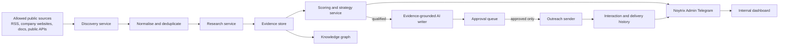
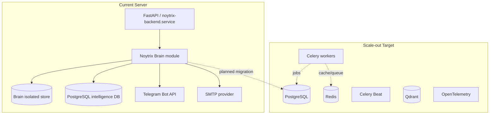

# Noytrix Brain Architecture

**Status:** approved implementation blueprint
**Owner:** Noytrix
**First production scope:** Pipeline 2, B2B partnership intelligence

## 1. Purpose

Noytrix Brain is the internal intelligence and outreach platform for Noytrix.
It discovers public business opportunities, builds evidence-backed dossiers,
scores their fit, prepares a genuinely specific outreach draft, and retains a
complete audit trail. It is not a bulk-email system.

The platform will eventually operate five independent pipelines:

1. IT jobs for the founder.
2. Noytrix B2B partnerships.
3. Altrixos acquisition and white-label buyers.
4. Noytrix communities, creators, and distribution partners.
5. Investors and accelerators.

The first release implements pipeline 2 end to end, so the shared foundations
are proven before the other pipelines add complexity.

## 2. Current State And Target State

| Area | Current production state | Target state |
| --- | --- | --- |
| API | FastAPI in `backend/`, deployed as `noytrix-backend.service` | FastAPI modular routers and services |
| Primary product data | SQLite with a separate PostgreSQL intelligence database | PostgreSQL for all Brain operational data |
| Background processing | FastAPI background loops | Redis, Celery workers, and Celery Beat |
| AI | OpenAI key already configured for Noytrix verdict explanations | role-specific AI calls with evidence-only prompts |
| Email | SMTP already configured for transactional mail | SMTP/Resend provider abstraction and delivery webhooks |
| Operations channel | Noytrix Admin Telegram bot already configured | approval, digest, error, and delivery reporting |
| Containers | Docker and Redis are not active on the server | Docker Compose or managed services when throughput requires it |

The initial Brain module is deliberately isolated from the existing product
database. It can run now without replacing working Noytrix services. A planned
migration moves its tables to PostgreSQL once the process has proven value.

## 3. Design Principles

- Evidence before language: a draft may only refer to facts stored in its dossier.
- Human approval before external outreach in the first production release.
- Public business data only; no account bypasses, private data collection, or
  scraping that violates a source's terms.
- Rate limits, contact suppression, and duplicate detection are mandatory.
- Every decision, generated draft, approval, and send attempt is auditable.
- An integration failure must never block Noytrix mobile scans or subscriptions.
- Secrets remain in server environment variables, never in the repository.

## 4. System Overview



## 5. Module Layout

The initial code lives under `backend/brain/` and has no dependency on mobile
application code.

```text
backend/brain/
  config.py          # non-secret configuration and safe defaults
  db.py              # schema, migrations, transactional connection helpers
  models.py          # typed domain objects
  repository.py      # persistence and deduplication queries
  discovery.py       # allowed source fetchers and seed expansion
  research.py        # factual page analysis and contact extraction
  scoring.py         # transparent partnership opportunity score
  writer.py          # evidence-constrained OpenAI draft generation
  outreach.py        # approval-gated outbound delivery interface
  reports.py         # Telegram summaries and operational metrics
  service.py         # orchestration for one pipeline run
  scheduler.py       # bounded recurring production jobs
  router.py          # internal API endpoints
  sources.json       # explicitly allowed public sources and categories
```

## 6. Agent Responsibilities

| Agent/service | Responsibility | May contact externally? |
| --- | --- | --- |
| Discovery | Reads approved sources and creates candidate entities | No |
| Research | Collects attributable public evidence and contacts | No |
| Evidence | Validates source URLs, timestamps, and confidence | No |
| Risk | Detects duplicates, restricted contacts, low confidence, and risky claims | No |
| Strategy | Scores business fit and suggests integration angle | No |
| Writer | Produces a concise, fact-specific outreach draft | No |
| Reviewer | Checks factual grounding, tone, consent, and deliverability | No |
| Memory | Stores interactions, suppression choices, and outcomes | No |
| Learning | Aggregates non-sensitive performance trends after enough data exists | No |
| Outreach | Sends one approved message through a configured provider | Yes, only approved |

## 7. Pipeline 2 Workflow

1. A scheduled run reads only explicitly allowed sources.
2. Company identity is normalized by domain and known social/company IDs.
3. Research records public evidence: product, category, API/docs, news,
   partnership pages, and visible business contact method.
4. The decision engine calculates fit, technical compatibility, revenue
   potential, timing, contact confidence, and risk.
5. Candidates below the threshold are retained as research only.
6. Qualified candidates receive an AI-written draft based exclusively on the
   saved evidence.
7. The Noytrix Admin bot receives the best opportunities and daily digest.
8. A human approves a specific draft before it can be delivered.
9. Delivery status, replies, rejection, and opt-out are stored permanently.

## 8. Security, Compliance, And Quality Controls

- Source allowlist, robots/terms review, request timeouts, and per-host limits.
- No LinkedIn, private API, authenticated session, or paywall bypass scraping.
- Public business emails only; no harvesting of personal email addresses.
- Suppression list is checked before every draft and every delivery.
- The same contact/company is never sent the same campaign twice.
- Sender is rate limited and starts disabled until a delivery provider is
  explicitly enabled.
- Every AI draft is rechecked against evidence; unsupported claims block it.
- Admin Telegram notifications mask email addresses.
- OpenAI, SMTP, and Telegram failures are isolated and retried without data loss.

## 9. Deployment Topology



## 10. Operational Boundaries

The initial implementation has a hard daily run cap, host-level fetch cap, and
an approval-only sender. It is intentionally useful in production without
pretending to be a fully autonomous sales machine. Automatic sending may be
enabled later only for explicitly approved segments after delivery, complaint,
and response metrics demonstrate safe behaviour.
