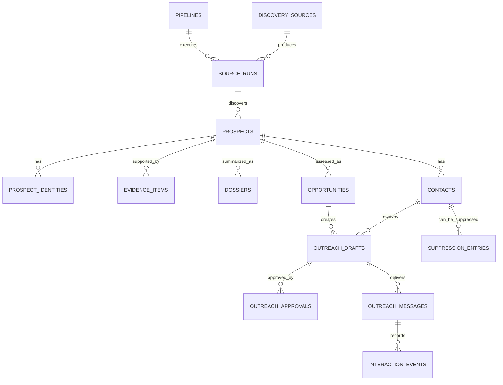

# Noytrix Brain Data Model

## Entity Relationship Diagram

## Core Tables

| Table | Purpose | Important fields |
| --- | --- | --- |
| `pipelines` | One record per business pipeline | `slug`, `name`, `enabled`, `send_mode` |
| `discovery_sources` | Allowed public sources | `url`, `source_type`, `category`, `enabled`, `terms_checked_at` |
| `source_runs` | Idempotent fetch and parse runs | `source_id`, `started_at`, `status`, `items_seen`, `error` |
| `prospects` | Canonical company/person opportunity | `name`, `primary_domain`, `category`, `status`, `first_seen_at` |
| `prospect_identities` | Domain and external identifiers | `prospect_id`, `identity_type`, `identity_value` |
| `evidence_items` | Traceable public facts | `prospect_id`, `source_url`, `claim_type`, `excerpt`, `captured_at`, `confidence` |
| `dossiers` | Current factual company summary | `prospect_id`, `summary_json`, `evidence_version`, `updated_at` |
| `opportunities` | Transparent decision and score | `prospect_id`, `fit_score`, `revenue_score`, `tech_score`, `timing_score`, `risk_score`, `overall_score`, `decision` |
| `contacts` | Public business contact channels | `prospect_id`, `email`, `role`, `source_url`, `consent_basis`, `status` |
| `outreach_drafts` | Evidence-constrained personalized drafts | `opportunity_id`, `contact_id`, `subject`, `body`, `evidence_ids_json`, `status` |
| `outreach_approvals` | Human approval audit | `draft_id`, `decision`, `approved_by`, `reason`, `created_at` |
| `outreach_messages` | Actual send attempts | `draft_id`, `provider`, `idempotency_key`, `status`, `sent_at`, `provider_message_id` |
| `interaction_events` | Replies, bounces, opens where available | `message_id`, `event_type`, `occurred_at`, `payload_json` |
| `suppression_entries` | Never-contact list | `email_or_domain`, `reason`, `created_at`, `expires_at` |

## Identity And Deduplication Rules

1. A company is unique by normalized primary domain where a domain is known.
2. External IDs are unique per provider and are supplemental identities, not
   replacement company records.
3. Contact email is normalized lower-case and belongs to one canonical prospect.
4. An idempotency key covers source ingestion, draft generation, approval, and
   delivery so a retry cannot duplicate an email.
5. Suppression wins over all other states.

## Score Formula For Pipeline 2

`overall = 0.30*fit + 0.20*technical_compatibility + 0.20*revenue_potential + 0.15*timing + 0.15*contact_confidence - risk_penalty`

Scores are accompanied by an explanation and evidence IDs. A candidate cannot
be marked ready for review without at least two attributable evidence items and
one verified public business contact method.
